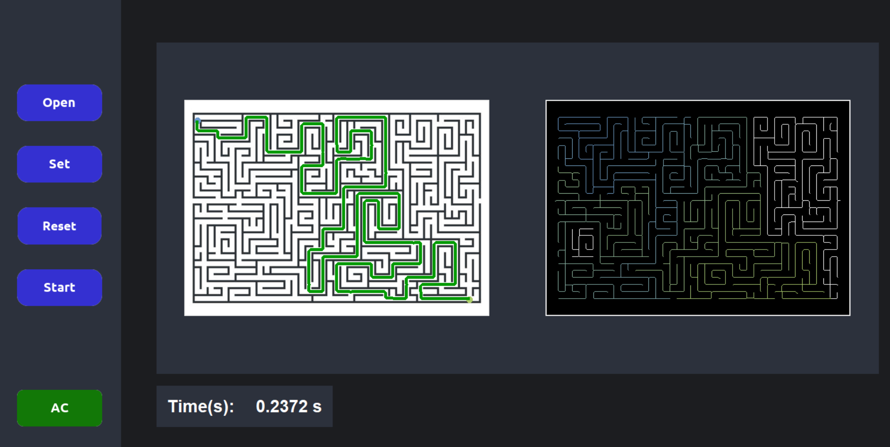
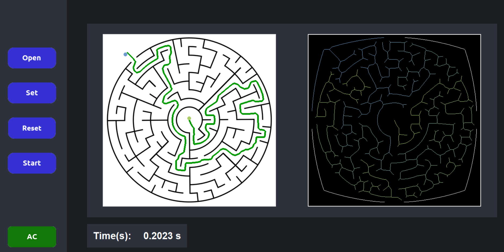

# Maze Image Solver

A tool that solves maze images using image preprocessing, skeletonization, and BFS.

## Description

This project preprocesses a maze image, extracts its skeleton, and applies Breadth-First Search (BFS) to quickly find the solution path.

## Features

- Image preprocessing to build up boundary so that the path won't go through outside the maze
- Skeletonization for path simplification
- BFS algorithm for fast pathfinding
- Visualization of the solved maze

## Demo

## How to Use

Follow these steps to solve a maze: 0. Execute **MazeApp.py**

1. Click **Open** to load a maze image.
2. Click **Set** to enable start and end point selection.
3. Click the left mouse button on the maze to mark the **start point**.
4. Click the left mouse button on the maze to mark the **end point**.
5. Click **Start** to run the solver and visualize the path.
6. Click **Reset** to clear the start and end points and try again.
